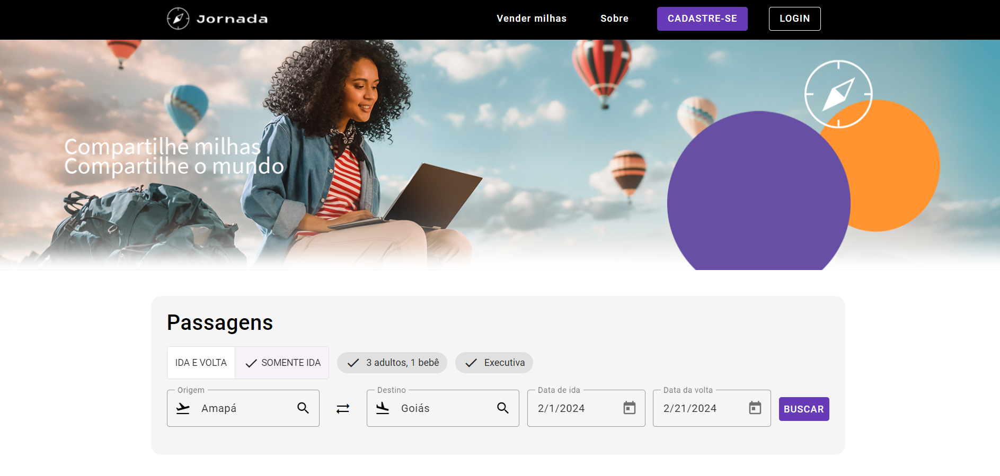
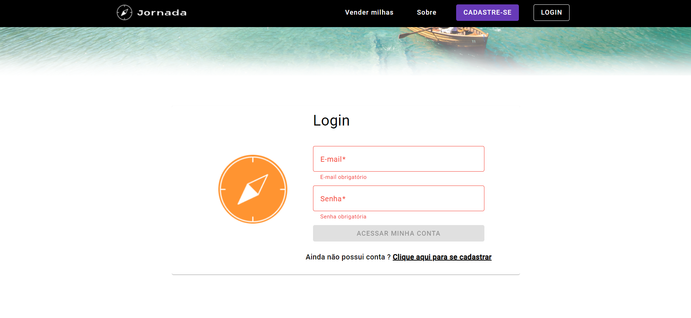

# Projeto Jonada Milhas

- O projeto foi desenvolvido para desenvolver os layouts das paginas usando a componentização e também autenticação de usuários.

 

### ✌️ Para usar o projeto
- Usado node.js versão 16.15.1

* Abra a basta "jornada-milhas" no cmd, no terminal digite: 

~~~npm
npm i
~~~

~~~npm
npm start
~~~

* Repita o mesmo processo para a pasta "api" para rodar o back-end

### 📌 Funcionalidades

- [x] Cadastro, Login e Logout de Usuário
- [x] Autenticação com Token
- [x] Permissão de acessos para visualizar informações do formulário.
- [x] Validação dos campos do formulário.

### ⌨️ Tecnologias

As seguintes ferramentas foram usadas na construção do projeto:

- Angular 16
- Angular Material 16
- Autenticação Jwt
- Formulários reativos

### ⚠️ Atenção
Obs: A parte de back-end já peguei pronta, eu não desenvolvi.